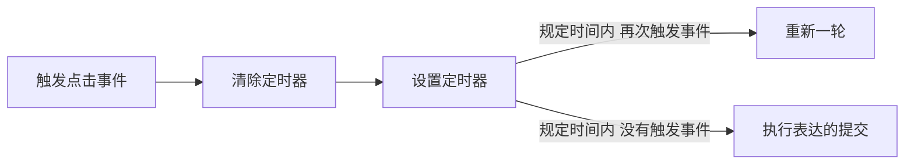

# 防抖（debounce）


比如，酒店的电动门

有人走进就打开，为了防止夹住人，就延迟几秒后关闭

若等待期间有人在靠近，会重新计算延迟


触发事件

setTimeout

clearTimeout


## 使用场景

改变页面大小的统计

滚动页面位置的统计

输入框连续输入的请求次数（**防止表单多次提交**）




## 流程和难点

### 1、设置事件

```js
const btn = document.querySelector('input');

function sendMessage(){
  console.log('提交表单')
};

btn.addEeventListener('click',sendMessage())

```


### 2、难点一：自动执行

设置并调用防抖函数后，未触发事件但会自动调用

```js
const btn = document.querySelector('input');

function sendMessage(){
  console.log('提交表单')
};


function debounce(func){
  func()
}


btn.addEeventListener('click',debounce(sendMessage)
```

---

解决方法：

通过高阶函数，让防抖函数返回一个函数

只有触发了事件才会调用函数

```js
const btn = document.querySelector('input');

function sendMessage(){
  console.log('提交表单')
};


function debounce(func){
  return function(){
    func()
  }
}


btn.addEeventListener('click',debounce(sendMessage)
```


### 3、设置延时 和 清除定时器

设置了定时器，就必须在设置前清除定时器，

但清除定时器clearTimeout**无法清除一个未被定义的变量**

所以在清除前先定义一个定时器变量

```js
const btn = document.querySelector('input');

function sendMessage(){
  console.log('提交表单')
};


function debounce(func,delayTime){
  return function(){
    let timer;
    clearTimeout(timer);
    timer = setTimeout(function(){
      func()
    },delayTime)
  }
}


btn.addEeventListener('click',debounce(sendMessage,1000)

```


### 4、难点二：定时器变量不唯一

若仅仅如上设定，规定时间内快速点击后，点击次数全部执行，

因为定时器变量的创建时在执行的函数内部

所以每次点击事件触发的函数都是独立的，**不是同一个变量**

即每次执行函数都会**重新创建新变量，清除不到定时器变量**

所以并没有出现延时执行和重新计时

---

解决方法：

通过作用域链 + 闭包

把创建定时器变量放在定义函数的外部，

每次执行函数时定义和清除的变量就是同一个，唯一的

```js
const btn = document.querySelector('input');

function sendMessage(){
  console.log('提交表单')
};


function debounce(func,delayTime){
  let timer;
  return function(){
    clearTimeout(timer);
    timer = setTimeout(function(){
      func()
    },delayTime)
  }
}


btn.addEeventListener('click',debounce(sendMessage,1000)
```


### 4、难点三：this指向

按理，提交函数中的this应该是指向函数的调用者，即发送按钮

但是，因为该提交函数是在定时器中被调用的，

而定时器中又是在window对象下被调用，

所以此时提交函数中的this成了window，出错了

```js
const btn = document.querySelector('input');

function sendMessage(){
  console.log('提交表单');
  // console.log(this) /// btn触发事件的按钮元素本身
};


function debounce(func,delayTime){
  let timer;
  return function(){
    clearTimeout(timer);
    timer = setTimeout(function(){
      func() /// 在定时器中被调用，是windows
      // console.log(this) // window
    },delayTime)
  }
}


btn.addEeventListener('click',debounce(sendMessage,1000)
```

---

解决方法：

在setTimeout定时器函数前，提前保留下this的指向，

然后用 **call**，把函数的调用者指向为保留的正确的this指向

```js
const btn = document.querySelector('input');

function sendMessage(){
  console.log('提交表单');
};


function debounce(func,delayTime){
  let timer;
  return function(){
    let context = this；
    clearTimeout(timer);
    timer = setTimeout(function(){
      // console.log(context) // btn 
      // console.log(this) // window      
      func.call(context) 
    },delayTime)
  }
}


btn.addEeventListener('click',debounce(sendMessage,1000)
```


### 5、难点四：参数

考虑到了this的指向，也要考虑参数的问题

JS的函数即使没设定参数也是可以传入参数的

每个执行函数都有可能被传入参数

传入的参数因该是给提交函数执行，需要通过 **apply** 传过去

```js
const btn = document.querySelector('input');

function sendMessage(){
  console.log('提交表单');
};


function debounce(func,delayTime){
  let timer;
  return function(){
    let context = this；
    let args = arguments;
    clearTimeout(timer);
    timer = setTimeout(function(){   
      func.apply(context，args) 
    },delayTime)
  }
}


btn.addEeventListener('click',debounce(sendMessage,1000)
```


综上，**防抖函数完成**

