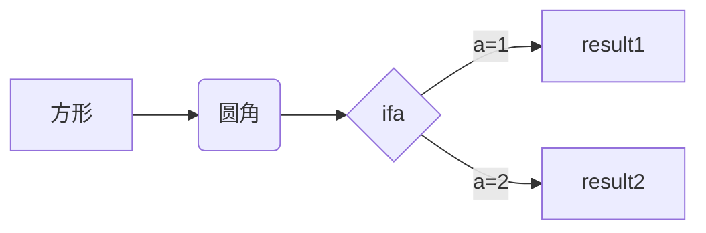
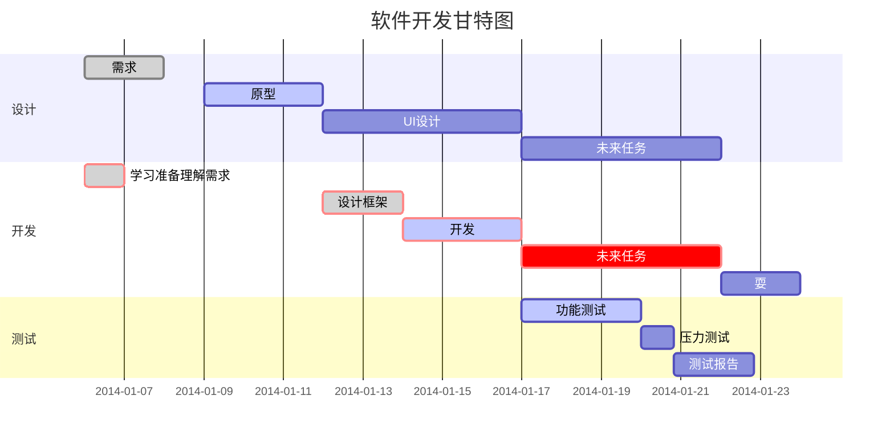

# 标题

一共1～6个等级

```java
# 一级标题       command + 1
## 二级标题      command + 2
### 三级标题     command + 3
#### 四级标题    command + 4
##### 五级标题   command + 5
###### 六级标题  command + 6
```


# 引用

> 鲁迅曾说过：这不是我说的

```java
> 引用文

command+option+Q
```


# 脚注

RegExp[^24]

[^24]:https://github.com/BlaxBerry

```java
RegExp[^24]
[^24]:https://github.com/BlaxBerry
```


# 列表

## 列表 - 有序列表

1. AAA   
2. BBB
3. CCC

```java
1. AAA   
2. BBB
3. CCC
  
command+option+O
```

1. AAA
   1. aaa11
   2. aaa22
2. BBB

```java
1. 多行列表
TAB 1. 多行列表
TAB TAB 1. 多行列表
```


## 列表 - 无序列表

- AAA
- BBB

```java
* AAA
* BBB
* CCC
  
 command+option+U
```

* AAA
  * aaa
  * aaa
    * bbb
    * bbb
      * dd
      * dd

```java
* 多行列表
TAB * 多行列表
TAB TAB * 多行列表
```


# 代码块

```js
let name = 'ruby';
let res = 'hello' + name;
```

```java
​```+ 回车
 
command+option+C
```


#  单行代码 

`hello world`

```java
` hello world ` + 回车
```


# 表格

| item | name |
| ---- | ---- |
|      |      |

```java
|表头|表头| + 回车
  
command+opinion+t
```


# 超链接

[my GitHub](https://github.com/BlaxBerry)

```java
[text](URL)
```


# 图片

用超链接


```java

```


# 分割线 

---

***

```java
---
  或
***
```


# 字体样式

## 字体样式 - 加粗

**哈哈哈**

```java
**哈哈哈**
  
command+b
```


## 字体样式 - 斜体

*哈哈*

```java
*哈哈*
  
 command+i
```


## 字体样式 - 下划线

<u>哈哈</u>

```
<u>哈哈</u>

command+u
```


## 字体样式 - 删除线

~~哈哈~~

```java
~~哈哈~~
```


# 特殊字符

\  转义符

© 版权

×乘号

÷除号

± 加减

< 小于号

\>大于号

≠不等号

≤ 小于等于

≥大于等于

 空格

&与

"双引号

'单引号

```java
&copy;     版权
&times;    乘号
&divide;   除号
&plusmn;   加减号
&lt;       小于号
&gt;       大于号
&ne;       不等号
&le;       小于等于
&ge;       大于等于
&nbsp;     空格
&amp;      与
&quot;     双引号
&apos;     单引号
```


# 数学表达式

$$
P_{u,i}=\frac{\sum_{j}^n(sum{_{u,j}})*R_{j,i}}{\sum_{j}^nsim_{u,j}}
$$

$$
Num = 100/2
$$

```java
输入$$ + 回车   
  
command+option+B
```


# UML时序图

```sequence
Andy->James: say hello
James-->Andy: not bad
```

```java
​```sequence + 回车
Andy->James: say hello
James-->Andy: not bad 
```

---

```sequence
Andy-->James: say hello
Note right of James:1
Note left of Andy:2
Note left of James:3
James-->Andy: not bad
Note right of James:4
Note right of James:5
```

```java
​```sequence + 回车
Andy-->James: say hello
Note right of James:1
Note left of Andy:2
Note left of James:3
James-->Andy: not bad
Note right of James:4
Note right of James:5
```


# 流程图

还没学

https://jingyan.baidu.com/article/48b558e3035d9a7f38c09aeb.html

https://www.jianshu.com/p/af48cc77b57a



```flow
st=>start: 开始框

op=>operation: 处理框

cond=>condition: 判断框(是或否?)

sub1=>subroutine: 子流程

io=>inputoutput: 输入输出框

e=>end: 结束框

st->op->cond

cond(yes)->io->e

cond(no)->sub1(right)->op
```


# 甘特图



